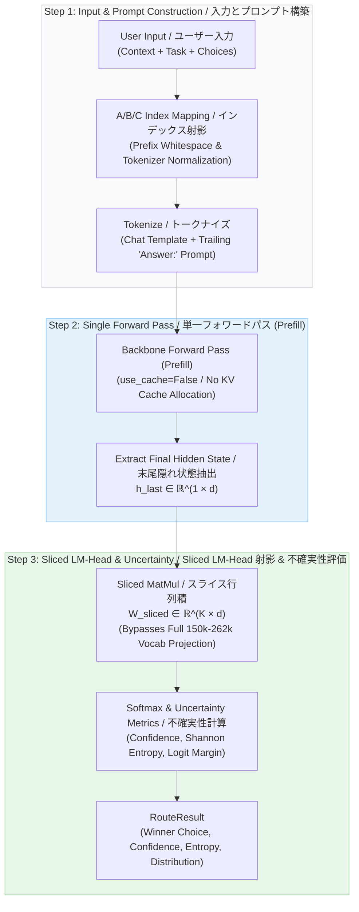

# Logit Router / ロジットルーター

**[English]**
Low-latency LLM routing via single forward pass logit extraction.
An experimental Python implementation that extracts candidate logits directly from the initial prompt prefill pass of open-source LLMs (**Gemma 4**, **Gemma 2**, **Qwen 2.5**, **Llama**, etc.), achieving dynamic classification in sub-100ms latencies without autoregressive decoding loops or KV cache allocation.

**[Japanese]**
単一フォワードパス（Prefill）からのロジット直接抽出による低遅延LLMルーティング。
オープンソースLLM（**Gemma 4**, **Gemma 2**, **Qwen 2.5**, **Llama 系列** 等）のプロンプト入力時フォワードパスから選択肢ロジットを直接抽出し、逐次自己回帰デコードループやKVキャッシュ確保を行わずに、実測数十ミリ秒台で動的ルーティングを実験的に実現した Python コードです。

---

## How It Works / 動作原理

**[English]**
Logit Router operates in three streamlined stages:
1. **Index Projection**: Candidate labels are mapped to single deterministic letters (`A`, `B`, `C`, ...), resolving token-boundary and leading-whitespace variations across BPE and SentencePiece tokenizers.
2. **Single Forward Pass (Prefill)**: The backbone model evaluates the prompt in a single pass (`use_cache=False`), extracting the hidden state $h_{\text{last}} \in \mathbb{R}^{1 \times d}$ corresponding to the final token position.
3. **Sliced LM-Head Projection**: Multiplies $h_{\text{last}}$ against a pre-cached submatrix containing exclusively the candidate token weights ($W_{\text{sliced}} \in \mathbb{R}^{K \times d}$), entirely bypassing the full projection over 150k–262k vocabulary tokens.

**[Japanese]**
Logit Router は以下の3ステップで処理を完結させます：
1. **インデックス射影マッピング**: 選択肢ラベルをアルファベット1文字（`A`, `B`, `C`, ...）に割り当て、BPEやSentencePieceにおける語頭空白やサブワード境界の分割問題を自動正規化。
2. **単一フォワードパス (Prefill)**: KVキャッシュ確保を無効化（`use_cache=False`）してプロンプト全体を1回だけ順伝播させ、末尾トークンの隠れ状態 $h_{\text{last}} \in \mathbb{R}^{1 \times d}$ を抽出。
3. **Sliced LM-Head 射影**: 事前キャッシュした選択肢行のみの重み行列（$W_{\text{sliced}} \in \mathbb{R}^{K \times d}$）と内積を計算し、全語彙（15万〜26.2万語）への巨大 MatMul を完全にバイパスして候補の確率分布を即座に算出。



---

## Features / 主な特徴

**[English]**
- **Zero Autoregressive Overhead**: Evaluates pure prompt prefill, achieving **1.6x to 5.8x speedup** (5.78x on Gemma 4) compared to standard `model.generate()`.
- **Multi-Model Family Support**:
  - **`google/gemma-4-E2B-it`**: Achieves **95.0% accuracy** on a 100-case enterprise matrix. Its 262k vocabulary compresses complex Japanese terms into single tokens.
  - **`Qwen/Qwen2.5` Series (0.5B / 1.5B / 3B)**: Balances low latency (16ms–62ms) with robust calibrated certainty.
  - **`Llama` Series & `SmolLM2`**: Supports Byte-level BPE architectures.
- **Sliced LM-Head Optimization**: Projects hidden states only onto candidate token indices ($K \ll V$). For a 262k vocabulary and 3 choices, projection operations are compressed to **~0.0011% (an 87,000x reduction)**, cutting 99.9989% of projection compute and memory traffic.
- **Quantization Support**: Native support for 4-bit / 8-bit (`bitsandbytes`) and AWQ Marlin kernels with automatic quantized-head fallback.
- **Hardware & Backend Acceleration**: Dynamic FlashAttention-2 / PyTorch SDPA dispatch and `torch.compile` (CUDA Graphs) integration.
- **Calibrated Cascade Routing**: Combines Shannon entropy with logit margin to trigger a Two-Tier cascade (Tier-1 fast gate $\rightarrow$ Tier-2 expert fallback).

**[Japanese]**
- **単一フォワードパス（Prefillのみ）**: 逐次デコードループとKVキャッシュを排除し、通常生成（`model.generate()`）比で **1.6倍〜5.8倍（Gemma 4 で 5.78倍）の高速化** を実現。
- **多様なモデルファミリー対応**:
  - **`google/gemma-4-E2B-it`**: 100問の実務評価で **最高正解率 95.0%** を記録。26.2万語の語彙により日本語複合語（「クレジットカード」等）を1トークンに圧縮。
  - **`Qwen/Qwen2.5` 系列 (0.5B / 1.5B / 3B)**: 16ms〜62msの低遅延と安定したエントロピー分離度を両立。
  - **`Llama` 系列 / `SmolLM2`**: Byte-level BPE モデルへの対応。
- **Sliced LM-Head 最適化**: 選択肢トークン行のみを行列積計算（語彙26.2万語・3選択肢の場合、全語彙射影の演算量を元の**約 0.0011%（約8.7万分の1）に圧縮し、99.9989% の計算量・メモリアクセスを削減**）。
- **量子化対応**: 4-bit / 8-bit (`bitsandbytes`) および AWQ Marlin 量子化ヘッドの自動フォールバック。
- **バックエンド最適化**: FlashAttention-2 / PyTorch SDPA の自動選択、および `torch.compile`（CUDA Graphs）対応。
- **不確実性評価とカスケード**: シャノンエントロピーとロジットマージンによる不確実性検知、2段階カスケード（Tier-1 ゲート $\rightarrow$ Tier-2 フォールバック）。

---

## Supported Models & Licenses / 対応モデルと各ライセンス

**[English]**
Validated open-source models, Hugging Face repository links, licenses, and benchmark verification status. While this codebase is released under the **MIT License**, model weights are downloaded directly from the Hugging Face Hub and are governed by their respective author licenses.

**[Japanese]**
本コードで動作検証・アーキテクチャ対応済みの代表的モデルおよび Hugging Face リンク、各ライセンスの一覧です。本リポジトリ自体は **MIT ライセンス** ですが、モデル重みは同梱しておらず、実行時に Hugging Face Hub からロードされます。各モデルの利用規約・ライセンスをご確認の上でご利用ください。

| Model ID / モデル名 | Hugging Face Link | License / ライセンス | Features & Recommended Use / 特徴・推奨用途 | On-Device Benchmark / 実機検証 |
| :--- | :--- | :--- | :--- | :--- |
| **`google/gemma-4-E2B-it`** | [google/gemma-4-E2B-it](https://huggingface.co/google/gemma-4-E2B-it) | [Gemma Terms](https://ai.google.dev/gemma/terms) (Commercial OK) | **Highest Accuracy (95.0%)**. 262k vocab Japanese compression / 最高精度・日本語複合語圧縮 | **Benchmarked (100 cases)** |
| **`Qwen/Qwen2.5-1.5B-Instruct`** | [Qwen/Qwen2.5-1.5B-Instruct](https://huggingface.co/Qwen/Qwen2.5-1.5B-Instruct) | [Apache 2.0](https://www.apache.org/licenses/LICENSE-2.0) (Commercial OK) | **Low Latency (~35ms)**. Ideal Tier-1 cascade gate / 低遅延ゲートに最適 | **Benchmarked (100 cases)** |
| **`Qwen/Qwen2.5-3B-Instruct`** | [Qwen/Qwen2.5-3B-Instruct](https://huggingface.co/Qwen/Qwen2.5-3B-Instruct) | [Apache 2.0](https://www.apache.org/licenses/LICENSE-2.0) (Commercial OK) | Balanced profile (85.0% accuracy / 62ms latency) / 精度・速度バランス型 | **Benchmarked (100 cases)** |
| **`Qwen/Qwen2.5-0.5B-Instruct`** | [Qwen/Qwen2.5-0.5B-Instruct](https://huggingface.co/Qwen/Qwen2.5-0.5B-Instruct) | [Apache 2.0](https://www.apache.org/licenses/LICENSE-2.0) (Commercial OK) | Fastest (~16ms / 0.96GB VRAM). Syntax-level triage / 最速・構文判定向け | **Benchmarked (100 cases)** |
| **`HuggingFaceTB/SmolLM2-360M-Instruct`** | [HuggingFaceTB/SmolLM2-360M-Instruct](https://huggingface.co/HuggingFaceTB/SmolLM2-360M-Instruct) | [Apache 2.0](https://www.apache.org/licenses/LICENSE-2.0) (Commercial OK) | Compact (23ms / 0.7GB VRAM). English explicit tasks / 小型・英語明示タスク向け | **Benchmarked (100 cases)** |
| **`meta-llama/Llama-3.2-1B-Instruct`** | [meta-llama/Llama-3.2-1B-Instruct](https://huggingface.co/meta-llama/Llama-3.2-1B-Instruct) | [Llama 3.2 Community](https://llama.meta.com/llama3/license/) (Commercial OK) | Llama ecosystem support (Byte-level BPE) / Llamaエコシステム対応 | Verified in Code |
| **`Qwen/Qwen2.5-1.5B-Instruct-AWQ`** | [Qwen/Qwen2.5-1.5B-Instruct-AWQ](https://huggingface.co/Qwen/Qwen2.5-1.5B-Instruct-AWQ) | [Apache 2.0](https://www.apache.org/licenses/LICENSE-2.0) (Commercial OK) | AWQ 4-bit Marlin kernel. Faster than BF16 (31ms / 84.0% acc) / AWQ Marlin 最適化 | **Benchmarked (100 cases)** |
| **`google/gemma-4-E2B-it` (4-bit)** | [google/gemma-4-E2B-it](https://huggingface.co/google/gemma-4-E2B-it) | [Gemma Terms](https://ai.google.dev/gemma/terms) (Commercial OK) | bitsandbytes 4-bit. Cuts VRAM by 32% while retaining 91.0% acc / VRAM 32% 削減 | **Benchmarked (100 cases)** |

---

## Installation / インストール

**[English]**
Install using `uv` (recommended):

**[Japanese]**
`uv` を用いたインストール（推奨）：

```bash
uv add logit-router
uv add logit-router[flash]  # Enable FlashAttention-2 / FlashAttention-2 有効化
uv add logit-router[dev]    # Development tools / 開発ツール
```

---

## Quick Start / クイックスタート

### 1. Low-Latency Routing / 低遅延ルーティング (Qwen 2.5 1.5B: ~35ms)
```python
from logit_router import LogitRouter

router = LogitRouter(model_id="Qwen/Qwen2.5-1.5B-Instruct")
result = router.route(
    context="Stripe webhook failed with status code 403.",
    instruction="担当チームにトリアージしてください。",
    choices=["決済・請求窓口", "インフラ保守", "一般サポート"],
)
print(result)
# {'best_choice': '決済・請求窓口', 'best_letter': 'A', 'confidence': 0.982, 'entropy': 0.041, ...}
```

### 2. High-Accuracy Japanese Routing / 最高精度・日本語特化ルーティング (Gemma 4: 95.0% Accuracy)
```python
router = LogitRouter(model_id="google/gemma-4-E2B-it")
result = router.route(
    context="ユーザーの個人情報（氏名、マイナンバー）が含まれている可能性があります。",
    instruction="適切なセキュリティトリアージ先を選択してください。",
    choices=["コンプライアンス法務室", "一般サポート", "社内ITヘルプデスク"],
)
print(result["best_choice"])  # "コンプライアンス法務室"
```

### 3. Uncertainty-Triggered Fallback / 不確実性検知とフォールバック (FallbackRouter)
```python
from logit_router.optimizations import FallbackRouter

def escalate_to_expert(context, instruction, choices):
    return {"best_choice": "専門調査チーム", "fallback_triggered": True}

fallback_router = FallbackRouter(
    router=router,
    entropy_threshold=0.35,  # Fallback if entropy is elevated / 確信が持てない場合にフォールバック
    margin_threshold=0.20,   # Fallback if top-2 logits are close / 上位2件が僅差の場合にフォールバック
    fallback_fn=escalate_to_expert,
)
```

### 4. Memory-Constrained Hardware / 低VRAM環境での量子化実行 (4-bit / AWQ)
```python
# bitsandbytes 4-bit NF4
router_4bit = LogitRouter(
    model_id="google/gemma-4-E2B-it",
    load_in_4bit=True,  # Reduces Gemma 4 VRAM from 9.76GB to 6.49GB / VRAMを約32%削減
)

# Dedicated AWQ Marlin 4-bit
router_awq = LogitRouter(
    model_id="Qwen/Qwen2.5-1.5B-Instruct-AWQ",
    is_awq=True,        # 31.4ms latency with Marlin FP16 GEMM / Marlinカーネルで31ms高速処理
)
```

---

## Empirical On-Device Benchmarks / 実機実測ベンチマーク

**[English]**
All metrics below were empirically measured on an **NVIDIA GeForce RTX 3060 12GB** (PyTorch 2.x SDPA, bfloat16, batch_size=1). No speculative or unmeasured numbers are presented.

**[Japanese]**
以下の数値は、ローカル環境（**NVIDIA GeForce RTX 3060 12GB**, PyTorch 2.x SDPA, bfloat16, batch_size=1）において実スクリプトを実行して計測された実測値です。推測値や未測定データは一切含みません。

### 1. Direct A/B Test vs. Standard Generation / 通常生成 (`model.generate()`) との直接対決実測
**[English]**
Direct A/B latency comparison between standard autoregressive generation (`model.generate()` single-character constraint) and LogitRouter using identical prompts and weights (see [Comparison Report](benchmarks/reports/comparison_vs_generation_report.md)):

**[Japanese]**
同一プロンプト・選択肢条件において、標準の自己回帰逐次生成（`model.generate()` 最短1文字指示）と LogitRouter の実行遅延を直接比較した A/B 実機実測値です（詳細は [通常生成比較レポート](benchmarks/reports/comparison_vs_generation_report.md) 参照）：

| Model / モデル | Standard Generation (`generate()` p50 / Mean) | **LogitRouter (p50 / Mean)** | Speedup / 高速化倍率 (p50比) | Notes / 備考 |
| :--- | :--- | :--- | :--- | :--- |
| **`google/gemma-4-E2B-it`** | 621.49 ms / 628.16 ms | **103.88 ms** / 108.71 ms | **5.78x Faster** | 262k vocab projection reduction effect is maximized / 語彙262kの射影削減効果最大 |
| `Qwen/Qwen2.5-3B-Instruct` | 200.42 ms / 228.07 ms | **85.04 ms** / 96.45 ms | **2.36x Faster** | Balanced speed and accuracy / 精度と速度のバランス型 |
| `Qwen/Qwen2.5-1.5B-Instruct` | 206.74 ms / 241.02 ms | **90.33 ms** / 103.70 ms | **2.32x Faster** | Optimal Tier-1 cascade gate / 第1層カスケードゲートに最適 |
| `Qwen/Qwen2.5-0.5B-Instruct` | 101.96 ms / 97.86 ms | **50.65 ms** / 59.49 ms | **1.64x Faster** | Lightweight (0.96GB VRAM) / 軽量・低VRAM（0.96GB） |
| `HuggingFaceTB/SmolLM2-360M-Instruct` | 133.01 ms / 131.90 ms | **25.97 ms** / 27.95 ms | **4.72x Faster** | Fastest, but struggles with Japanese nuance / 最速だが日本語・複合推論に課題 |

*Note: The p50 values above reflect isolated A/B test prompts. For holistic latencies across 100 diverse enterprise prompts, refer to Section 2 below (e.g., Gemma 4 holistic p50 is 67.83 ms, Qwen 1.5B is 34.84 ms).*

### 2. Deep 10-Domain Benchmark Matrix (100 Real-World Cases) / 10大ドメイン・計100問の深層評価マトリクス
**[English]**
Comprehensive empirical evaluation across 100 operational scenarios covering tool selection, PII compliance, ambiguity resolution, multilingual dispatch, and emergency triage (see [Deep Evaluation Report](benchmarks/reports/deep_eval_report.md)):

**[Japanese]**
多様な業務課題（ツール選択、PII法令、曖昧性解決、多言語、緊急度トリアージ等）100問による実機評価（詳細は [100問深層評価レポート](benchmarks/reports/deep_eval_report.md) 参照）：

| Candidate Model / 候補モデル | Accuracy / 正解率 (100問) | p50 Latency | Peak VRAM | Mean Conf | Characteristics & Japanese Fit / 特徴と日本語適合性 |
| :--- | :---: | :---: | :---: | :---: | :--- |
| **`google/gemma-4-E2B-it`** | **95.0%** (95/100) | **67.83 ms** | 9.76 GB | 0.9945 | **Highest Accuracy**. 100% in 7 domains. Strong Japanese nuance interpretation / 最高精度（7ドメインで100%達成） |
| `Qwen/Qwen2.5-3B-Instruct` | **85.0%** (85/100) | 62.76 ms | 5.91 GB | 0.9688 | Robust entropy calibration / 安定したエントロピー分離度 |
| `Qwen/Qwen2.5-1.5B-Instruct` | **81.0%** (81/100) | 34.84 ms | 2.96 GB | 0.8656 | >80% accuracy in sub-35ms latency / 35ms以下の高速判定で8割超の精度 |
| `Qwen/Qwen2.5-0.5B-Instruct` | **73.0%** (73/100) | 16.26 ms | 0.96 GB | 0.7331 | Effective syntax classifier, limited on nuance / 構文判定は優秀だが行間解釈に限界 |
| `HuggingFaceTB/SmolLM2-360M-Instruct` | **23.0%** (23/100) | 23.76 ms | 0.71 GB | 0.4275 | Severe overconfident failures on Japanese tasks / 日本語や複雑推論で大幅な過信誤分類 |

### 3. Quantization Benchmark (4-bit & AWQ on 100 Cases) / 4-bit 量子化・AWQ 実機実測値
**[English]**
Measured performance on resource-constrained hardware using 4-bit quantization (bitsandbytes NF4 and AWQ Marlin) across the identical 100 enterprise cases (see [Quantization Report](benchmarks/reports/quantization_matrix_report.md)):

**[Japanese]**
VRAM 制約環境向けの 4-bit 量子化（bitsandbytes NF4 および AWQ Marlin）における、同一100問実務データセットでの実測値です（詳細は [量子化ベンチマークレポート](benchmarks/reports/quantization_matrix_report.md) 参照）：

| Configuration / 設定・モデル | Quant Method / 手法 | Accuracy (100問) | p50 Latency | Peak VRAM | Baseline Comparison / ベースライン比較 |
| :--- | :--- | :---: | :---: | :---: | :--- |
| **`google/gemma-4-E2B-it` (4-bit)** | bitsandbytes NF4 | **91.0%** (91/100) | 171.89 ms | **6.49 GB** (6643 MB) | **32% VRAM reduction** (-3.1GB), retaining 91% accuracy / 精度91%維持 |
| **`Qwen2.5-1.5B-Instruct-AWQ`** | AWQ 4-bit (Marlin) | **84.0%** (84/100) | **31.41 ms** | **2.96 GB** (3033 MB) | **Fast 31ms**, higher accuracy than unquantized baseline (+3%) / 高速処理 (31ms) |

### 4. Layer Factor Decomposition Profile / 要因分解プロファイル (`bench_profile.py`)
**[English]**
Execution breakdown per pipeline stage for a single query (~135 sequence tokens, measured via CUDA events):

**[Japanese]**
単一クエリ（系列長 約135トークン, CUDA Event 計測）における処理フェーズ別の実行時間：

| Pipeline Stage / 処理フェーズ | Measured Time / 実測時間 (ms) | Ratio / 割合 (%) | Notes / 備考 |
| :--- | :---: | :---: | :--- |
| Tokenization & Tensor Transfer / トークナイズ & テンソル転送 | 0.46 ms | 1.62% | Host CPU processing & HtoD transfer |
| Backbone Forward Pass / バックボーン順伝播 | 27.97 ms | 97.56% | Transformer prefill computation |
| Sliced LM-Head MatMul / スライス行列積 | 0.05 ms | 0.16% | Evaluates $K=3$ candidate tokens only (bypasses full vocab) |
| Post-processing & Entropy / 後処理 & 不確実性計算 | 0.19 ms | 0.66% | Softmax, entropy, and dictionary packaging |
| **Total Inference Time / 合計推論時間** | **28.67 ms** | **100.0%** | Measured model: `Qwen2.5-0.5B-Instruct` |

### 5. Critical Failure Analysis & Recommended Architecture / 批判的分析と推奨アーキテクチャ
**[English]**
- **Overconfident Misclassifications in Sub-1B Models**: While 0.5B and 360M models handle explicit tasks well, they suffer from overconfidence (assigning >85% probability and deceptively low entropy to wrong choices) on nuanced reasoning and severity escalation.
- **Recommended Two-Tier Cascade Architecture**:
  1. **Tier-1 Fast Gate**: `Qwen2.5-1.5B` (~35ms). Decisive queries ($H < 0.35$ and margin $\Delta z > 1.5$, covering ~80% of traffic) are routed immediately.
  2. **Tier-2 High-Capacity Fallback**: Ambiguous or difficult queries (~20%) escalate to `google/gemma-4-E2B-it` (95.0% accuracy).
  - Expected latency: $E[T] = 0.80 \times 34.8\,\text{ms} + 0.20 \times (34.8 + 67.8)\,\text{ms} \approx \mathbf{48.4\,\text{ms}}$, achieving **sub-50ms average speed with 95% enterprise accuracy**.

**[Japanese]**
- **1B未満モデルの限界と過信誤分類**: 360M や 0.5B は構文・明示的タスクで高い正解率を示しますが、行間の意図解釈や緊急度判定で誤分類が発生しやすく、誤答時にも確信度が高くなる（エントロピーが欺瞞的に低くなる）過信現象が確認されました。
- **推奨アーキテクチャ（2段階カスケード構成）**:
  1. **第1層（高速ゲート）**: `Qwen2.5-1.5B`（約35ms）で一次判定。エントロピー $H < 0.35$ かつロジットマージン $\Delta z > 1.5$（明確な約80%のクエリ）は即座に確定。
  2. **第2層（高精度フォールバック）**: 曖昧な難問（約20%）のみを `google/gemma-4-E2B-it`（95%精度）へエスカレーション。
  - これにより、全体として **平均約48msの低遅延を維持しながら、95%水準の最高精度を両立** できます。

For complete architectural details, see [Cascade Routing & Critical Analysis](docs/architecture/cascade_routing_and_critical_analysis.md).

---

## Documentation / ドキュメント一覧

- **[Architecture (アーキテクチャ設計)](docs/architecture/)**:
  - [Single Forward Pass Routing (単一フォワードパスルーティング)](docs/architecture/single_forward_pass_routing.md)
  - [Cascade Routing & Critical Analysis (カスケードルーティングと批判的分析)](docs/architecture/cascade_routing_and_critical_analysis.md)
  - [Gemma 4 & Quantization Strategies (Gemma 4 と量子化技術)](docs/architecture/gemma_and_quantization.md)
- **[Domain & Implementation (実装仕様)](docs/domain/)**:
  - [Router Implementation Details (LogitRouter 実装詳細仕様)](docs/domain/router_implementation_details.md)
- **[Empirical Benchmarks (実機測定レポート)](docs/references/)**:
  - [Deep 10-Domain Benchmark Report (10大ドメイン100問深層実機評価)](docs/references/deep_eval_report.md)
  - [Quantization Benchmark Report (4-bit / AWQ 量子化実機評価)](docs/references/quantization_matrix_report.md)
  - [Comparison vs Standard Generation (通常生成との比較実測)](docs/references/comparison_vs_generation_report.md)
  - [Benchmarks & Metrics Specification (評価指標と測定プロトコル)](docs/references/benchmarks_and_metrics.md)

---

## API Reference / API リファレンス

### `LogitRouter`
**[English]** The primary router class responsible for model loading, tokenizer whitespace normalization, weight slicing, and single-pass logit classification.
**[Japanese]** モデル読み込み、トークナイザー空白正規化、LM-Head 重みスライス、および単一パス推論を実行するメインクラス。

### `RouteResult`
**[English]** A strongly typed result dictionary / dataclass containing the winner choice, predicted letter, normalized probabilities, confidence score, and Shannon entropy.
**[Japanese]** 勝者選択肢、予測文字記号、正規化確率分布、確信度スコア、およびシャノンエントロピーを保持する結果オブジェクト。

---

## License / ライセンス

**[English]**
This project's source code is distributed under the [MIT License](LICENSE).
Pretrained model weights loaded at runtime from the Hugging Face Hub are subject to their respective creators' licenses (Gemma Terms of Use, Apache 2.0, Llama 3.2 Community License). Please consult the Supported Models table above for details.

**[Japanese]**
本プロジェクトのソースコードは [MIT License](LICENSE) の下で公開されています。
なお、実行時に Hugging Face Hub からロードされる学習済みモデル重みは、各モデル提供元（Google, Alibaba Cloud, Meta 等）のライセンス条項（Gemma Terms of Use, Apache 2.0, Llama 3.2 Community License 等）に従います。詳細は上記対応モデル一覧をご確認ください。
