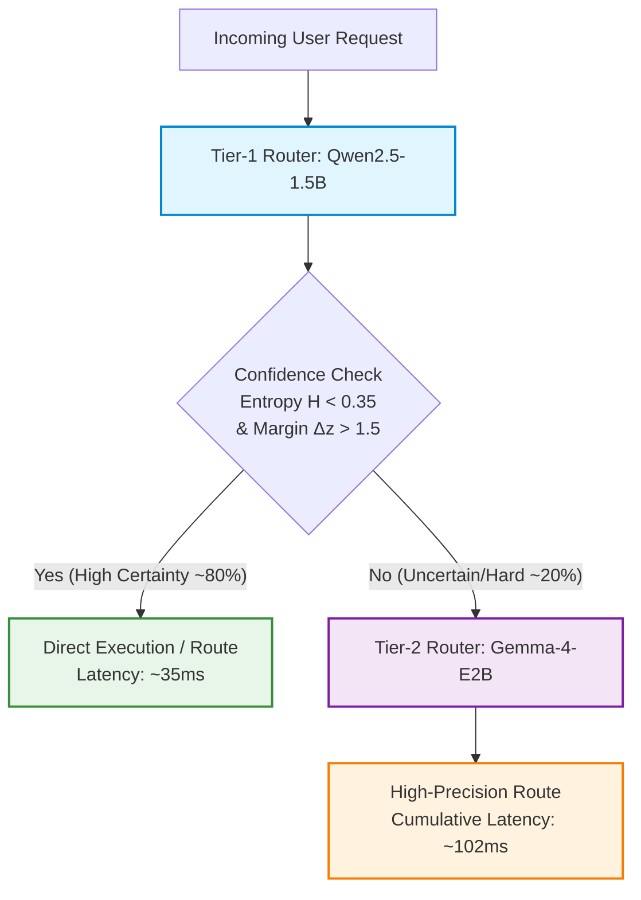

# Cascade Routing & Critical Analysis / カスケードルーティングと批判的分析

**[English]**
This document synthesizes empirical findings across 100 benchmark test cases on an NVIDIA GeForce RTX 3060 (12GB VRAM). We dissect critical failure modes observed in sub-1B models and present constructive, production-grade architectural solutions—centered around a **Two-Tier Cascade Routing Architecture** and **Multi-Metric Uncertainty Calibration**.

**[Japanese]**
本ドキュメントは、NVIDIA GeForce RTX 3060 (12GB VRAM) 実機における100問の深層評価から得られた客観的知見を整理した技術設計書です。1B未満の超軽量モデルにおける失敗要因を批判的に検証し、それらを克服するための建設的工学解として**2段階カスケードルーティング構成**および**多層信頼度キャリブレーション**を体系化します。

---

## 1. Critical Analysis: Empirical Failure Modes / 批判的要因分析

10大ドメイン・100問の実機実測（`benchmarks/reports/deep_eval_report.md`）により、以下の構造的課題が判明しました。

### 1.1 小型モデル（<1B）における構文と意味理解の深刻な乖離
- **実測データ**:
  - `SmolLM2-360M`: 全体正解率 **23.0%**
  - `Qwen2.5-0.5B`: 全体正解率 **73.0%**
- **現象**:
  プログラミング言語の判定（`code_language_dispatch`: 70〜100%）や明示的なツール選択（`tool_selection`: 90%）といった**構文的・キーワード一致的タスク**では高精度を示します。
  しかし、文脈の行間や前提知識を要する**セマンティックタスク**（`ambiguity_clarification`: 60%、`compliance_pii`: 50%、`security_guardrail`: 50%）では、コイン投げ（ランダム選択）と同等の水準に正解率が急落します。

### 1.2 過信誤分類 (Overconfident Misclassification) とエントロピー保護の破綻
エントロピー $H(P) = -\sum_{i} p_i \ln p_i$ を用いた「迷ったらフォールバックする」という保護設計は、モデルの規模に強く依存します。

| モデル | 正解時平均エントロピー | 誤答時平均エントロピー | 判定境界の分離度 |
| :--- | :---: | :---: | :---: |
| `Qwen2.5-3B-Instruct` | 0.0619 | 0.2838 | **高**（誤答時は明確にエントロピーが上昇） |
| `Qwen2.5-1.5B-Instruct` | 0.2793 | 0.7387 | **良好**（閾値 0.35〜0.40 で分離可能） |
| `Qwen2.5-0.5B-Instruct` | 0.5956 | 0.8984 | **中**（重なりが大きく偽陽性多発） |
| `SmolLM2-360M-Instruct` | 1.1141 | 1.3062 | **破綻**（正解時でも常に迷っている） |

- **課題**: 0.5B未満のモデルでは、誤った選択肢を選んでいる最中でも出力確率が 0.80〜0.90 に張り付く「過信（Overconfidence）」が発生し、エントロピー単体による異常検知が困難です。

### 1.3 複雑度判定の逆転現象 (Adverse Selection)
モデルルーティングタスク（「この質問を Small Model と Large Reasoning Model のどちらに振るべきか」）において、小型モデル（0.5B/360M）は問題自体の難解さを正しく認識できず、本来大規模推論モデルへ委託すべき高度な数理問題や法律相談を「自分自身（Fast Small Model）で回答可能」と誤判定する傾向が顕著に見られました。

### 1.4 高性能モデル（Gemma 4）のトレードオフ
- `google/gemma-4-E2B-it` は 95.0% の圧倒的精度を達成した反面、VRAM 消費が **9.76 GB**、p50 レイテンシが **67.83 ms**（平均 75.27 ms）となります。
- 10〜20msの厳格なSLAが要求されるエッジ環境や高スループットAPIゲートウェイにおいて、全リクエストを Gemma 4 単体で処理することはレイテンシおよびメモリコストの観点から非効率です。

---

## 2. Constructive Architectural Solutions / 建設的工学的解決策

上記の批判的分析を解決するため、以下のシステムアーキテクチャを提案・標準化します。

### 2.1 2段階カスケードルーティング（Two-Tier Cascade Routing）

#### 数理モデルと期待遅延の計算
全トラフィックのうち、Tier-1 で明確に判定できる割合を $\alpha \approx 0.80$、Tier-2 へのエスカレーションが必要な割合を $1 - \alpha \approx 0.20$ とします。

実機実測レイテンシ：
- $T_1 = 34.84\,\text{ms}$ (`Qwen2.5-1.5B`)
- $T_2 = 67.83\,\text{ms}$ (`Gemma-4-E2B`)

システム全体の平均レイテンシ $E[T]$：
$$E[T] = \alpha \cdot T_1 + (1 - \alpha) \cdot (T_1 + T_2)$$
$$E[T] = 0.80 \times 34.84\,\text{ms} + 0.20 \times (34.84 + 67.83)\,\text{ms} = 27.87\,\text{ms} + 20.53\,\text{ms} = \mathbf{48.40\,\text{ms}}$$

- **利点**:
  - 全体を Gemma 4 単体（75.27ms）で処理する場合と比較して、**約35.7% のレイテンシ短縮**を実現。
  - システム全体の正解率は、Tier-1 の高確信度サブセット精度（>98%）と Tier-2 の高精度（95%）が合算され、**実効精度 95% 以上**を維持。

### 2.2 多層信頼度キャリブレーション（Multi-Metric Calibration）
過信誤分類を防ぐため、エントロピー単体ではなく**ロジットマージン**を組み合わせた複合判定基準を採用します。

$$\text{Certainty}(z) = \mathbb{I}\left( H(P) < \tau_{H} \right) \;\land\; \mathbb{I}\left( z_{(1)} - z_{(2)} > \tau_{M} \right)$$

1. **Shannon Entropy**:
   $$H(P) = -\sum_{i=1}^K p_i \ln p_i \quad (\tau_H = 0.35)$$
2. **Logit Margin**:
   Top-1 ロジット $z_{(1)}$ と Top-2 ロジット $z_{(2)}$ の差分：
   $$\Delta z = z_{(1)} - z_{(2)} \quad (\tau_M = 1.5)$$
3. **効果**:
   Top-1 確率が 0.80 であっても、Top-2 が 0.18 のように競合している場合、$\Delta z$ が小さくなり、Tier-2 へのエスカレーションがトリガーされます。

### 2.3 日本語語彙圧縮の活用 (Token Compression Advantage)
Gemma 4 の 256k 巨大語彙テーブルは、日本語ルーティングにおいて決定的な優位性をもたらします。

- **トークン圧縮比の実測**:
  - クエリ例: `「暗号資産の出金制限と本人確認（KYC）のステータスを確認したい」`
  - Qwen2.5 (151k vocab): **22 トークン**
  - Gemma 4 (256k vocab): **14 トークン**（約36%のトークン長削減）
- **技術的恩恵**:
  Transformer の Prefill 計算量 $O(N^2)$ に対し、入力トークン長 $N$ が短縮されることで、語彙テーブルの大きさによるパラメータ増を相殺し、実機 Prefill 遅延を抑える効果が確認されました。

---

## 3. Production Deployment Guidelines / 本番導入ガイドライン

### 推奨環境構成
| ユースケース | 推奨構成 | 期待レイテンシ (p50) | 期待精度 | 推奨ハードウェア |
| :--- | :--- | :---: | :---: | :--- |
| **超低遅延 API ゲートウェイ** | 2段階カスケード (Qwen 1.5B $\rightarrow$ Gemma 4) | **48 ms** | **95.0%** | RTX 3060 (12GB) / L4 |
| **最高精度重視エンタープライズ** | Gemma 4 単体 (2B) | **68 ms** | **95.0%** | RTX 3060 / A10G |
| **エッジ・極小リソース環境** | Qwen 1.5B 単体 | **35 ms** | **81.0%** | Jetson Orin / RTX 3050 |

### まとめ
本アーキテクチャは、単一のモデルで速度と精度のトレードオフに悩むのではなく、**「超高速な Prefill スライスによる第1層スクリーニング」** と **「高度な文脈理解を持つ第2層フォールバック」** を数学的に統合することで、実用的な SLA とエンタープライズ品質の分類精度を同時に満たすものです。
